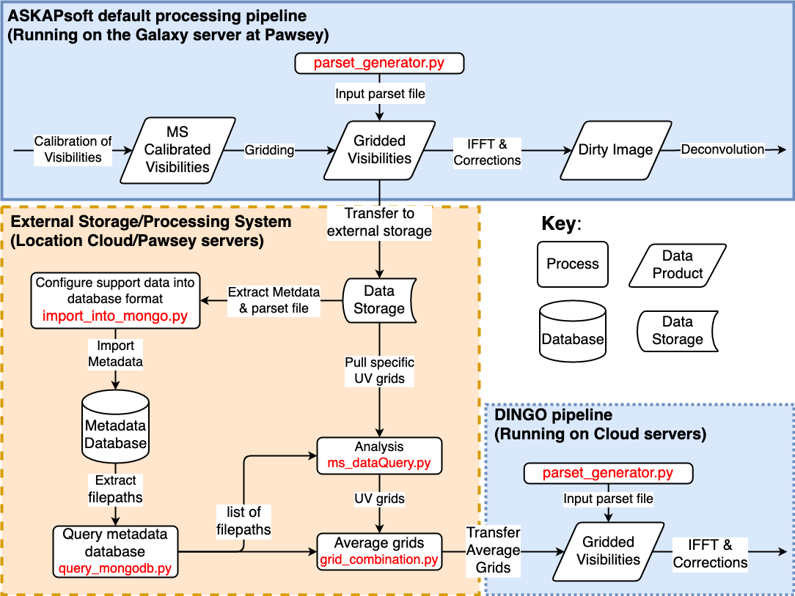

# DINGO storage Development
DINGO storage system development

A major challenge for any deep astronomical survey is the storage of large files generated from the instruments such as ASKAP and in the near future SKA.  This repository possesses the scripts in taking the UV-grids generated from ASKAPsoft, the system required to store the data and metadata, and importing it into the DINGO pipeline.  This project is carried as a part of the ADACS long term support program (2019/2020).

The blue areas are the pipelines from YANDAsoft/DINGO.  The orange area indicates the proposed system which is located in a different location such as cloud service.  The main path is the gridded visibilities are pulled from YANDAsoft and stored at an external location.  The metadata and supplementary information (such as parset file) is extracted and stored in a metadatabase.  Through the metadatabase you can create a short list of files which you want to use for analysis or further processing.  The analysis and averaging of the gridded visiblities can be achieved through TaQL.

## Files

### TaQL_DINGO_demostration.ipynb
Demostration of using the python interface python-casacore TaQL.  This can replace the python script grid_combination.py and UVGrid_average.py.

### UVGrid_average.py 	
UV Grid merging tool for the DINGO pipeline. Originally based on pipeline demo from Kristof Rozgonyi (script grid_combination.py).

### ms_dataQuery.ipynb 
Exploring the methods to query UV grid metadata.

### parset_generator.py
Create the parset file for the ASKAPsoft data reduction.
